<!-- ============================================================
     rxit — GitHub profile README
     CONCEPT: "THE CASE FILES" — an evidence dossier.
     Each flagship product is a mini case study: Problem → Built → Result → live link.
     All hero/graphic SVGs are self-contained (correct on GitHub light + dark).
     ============================================================ -->

  <a href="https://aumiqx.com"><b>Live work ↗</b></a> &nbsp;·&nbsp;
  <a href="https://cal.com/rakshit-sharma-k1iaos">Book a call</a> &nbsp;·&nbsp;
  <a href="mailto:rxits@proton.me">rxits@proton.me</a> &nbsp;·&nbsp;
  <a href="./assets/rxit-cv.pdf">CV (PDF)</a> &nbsp;·&nbsp;
  <a href="https://github.com/rxits">@rxits</a>

---

Most profiles tell you what someone *can* do. This one is a case file of what's already **live**.

Below are the products I've built and still run in production — the problem each one solved, what I shipped, and where to click to watch it work. Every link is a real, load-bearing thing on the internet. I build them at **[Aumiqx](https://aumiqx.com)**, my studio, and lately I lean on AI agents as an engineering multiplier — more surface shipped per week, same bar for quality.

## 📁 Case files

> Five records from production. Each one is live and clickable — the **Result** line is the 8-second version.

<!-- ─────────────── CASE FILE 01 ─────────────── -->
<table>
<tr>
<td valign="top" width="35%">

</td>
<td valign="top" width="65%">
<b>CASE FILE 01 · NY Elizabeth</b> — real-time auctions  
<b>Problem</b> — an international luxury auction house needed to run live, clerk-driven auctions online: every bid reflected in real time, money moving safely.  
<b>Built</b> — a real-time bidding engine on <code>Socket.IO</code> + <code>Redis</code>, a clerk console for live lots, <code>Stripe&nbsp;Connect</code> payouts, and a <code>Flutter</code> app for bidders.  
▸ <b>Result — live, real-money clerk-driven auctions running in production for an international house.</b> &nbsp;<a href="https://bid.nyelizabeth.com">bid.nyelizabeth.com ↗</a> · [GMV / bid-volume TK]
</td>
</tr>
</table>

<!-- ─────────────── CASE FILE 02 ─────────────── -->
<table>
<tr>
<td valign="top" width="35%">

</td>
<td valign="top" width="65%">
<b>CASE FILE 02 · SalesClawd</b> — autonomous marketing "employee"  
<b>Problem</b> — small businesses can't staff a full marketing team, but still need the output a team produces.  
<b>Built</b> — an autonomous marketing hire: <code>3 AI agents</code> working across <code>18 platforms</code> with trust-gated autonomy — the owner approves what matters, the rest runs on its own. Built on <code>Claude</code> + <code>Gemini</code> with custom orchestration.  
▸ <b>Result — a working autonomous marketing employee in production: 3 agents, 18 platforms, trust-gated.</b> &nbsp;<a href="https://salesclawd.aumiqx.com">salesclawd.aumiqx.com ↗</a> · [active accounts TK]
</td>
</tr>
</table>

<!-- ─────────────── CASE FILE 03 ─────────────── -->
<table>
<tr>
<td valign="top" width="35%">

</td>
<td valign="top" width="65%">
<b>CASE FILE 03 · Art Index</b> — marketplace + price database  
<b>Problem</b> — art buyers had nowhere to search a market's price history and bid on live lots against reliable data.  
<b>Built</b> — an art marketplace and price database with live auctions, on an Artsy / <code>Algolia</code> data layer with fast search and daily data pipelines.  
▸ <b>Result — a live marketplace and searchable price database, in production.</b> &nbsp;<a href="https://artindex.ai">artindex.ai ↗</a> · [catalog size TK]
</td>
</tr>
</table>

<!-- ─────────────── CASE FILE 04 ─────────────── -->
<table>
<tr>
<td valign="top" width="35%">

</td>
<td valign="top" width="65%">
<b>CASE FILE 04 · air-up</b> — client · Germany 🇩🇪  
<b>Problem</b> — a €200M+ German DTC brand needed production-grade frontend shipped to a high-traffic storefront, held to a high bar.  
<b>Built</b> — production frontend built and shipped straight into air-up's live storefront on <code>TypeScript</code> + <code>Next.js</code>.  
▸ <b>Result — shipped to production for a €200M+ European DTC brand.</b> &nbsp;<a href="https://air-up.com">air-up.com ↗</a> · international, high-traffic, real revenue
</td>
</tr>
</table>

<!-- ─────────────── CASE FILE 05 ─────────────── -->
<table>
<tr>
<td valign="top" width="35%">

</td>
<td valign="top" width="65%">
<b>CASE FILE 05 · Beast</b> — client · London 🇬🇧  
<b>Problem</b> — a Cannes Lions–winning London creative studio needed their full site built, on their stack, to their standard.  
<b>Built</b> — the full site, built solo on the studio's own stack.  
▸ <b>Result — full site shipped for a Cannes Lions–winning London studio, built solo.</b> &nbsp;<a href="https://beast.agency">beast.agency ↗</a> · international client, award-grade bar
</td>
</tr>
</table>

#### Also shipped &amp; running

<table>
<tr>
<td width="33%" valign="top"> The studio itself — 342 programmatic-SEO pages, daily data pipelines, static-export CI.</td>
<td width="33%" valign="top"> Wellness platform — multi-vendor Shopify dashboard + a webhook commission engine.</td>
<td width="33%" valign="top"> Rockport India — men's footwear e-commerce on Shopify.</td>
</tr>
</table>

---

## 🗣️ Field reports

Real quotes from these teams are being collected — the cards above are placeholders until each is signed off. No invented praise here; when a quote lands, it goes in verbatim with attribution.

<!-- TESTIMONIAL PLACEHOLDER: real quote from air-up (Germany) — TBD, awaiting sign-off -->
<!-- TESTIMONIAL PLACEHOLDER: real quote from Beast (London) — TBD, awaiting sign-off -->
<!-- TESTIMONIAL PLACEHOLDER: real quote from NY Elizabeth — TBD, awaiting sign-off -->

---

## 📊 By the numbers

---

## 🧰 Stack

Tools that show up in the case files above — not a wishlist.

| Layer | Tools |
|---|---|
| **Languages** | `TypeScript` · `Python` |
| **Frameworks** | `Next.js` · `Flutter` |
| **Data** | `Postgres` · `Redis` · `Supabase` |
| **AI** | `Claude` · `Gemini` · custom agent orchestration |
| **Commerce & real-time** | `Shopify` · `Stripe Connect` · `Socket.IO` · `Algolia` |
| **Infra** | `Docker` · `Vercel` · `Cloudflare` |

---

## 🟩 On GitHub

<!-- Live external image services (github-readme-stats, ghchart). Themed via <picture> so both GitHub light + dark render correctly. See NOTES.md. -->

<table>
<tr>
<td width="50%">
<picture>
  <source media="(prefers-color-scheme: dark)" srcset="https://github-readme-stats.vercel.app/api?username=rxits&show_icons=true&hide_border=true&count_private=true&include_all_commits=true&bg_color=0f1116&title_color=d7a13b&text_color=99a0af&icon_color=d7a13b">
  
</picture>
</td>
<td width="50%">
<picture>
  <source media="(prefers-color-scheme: dark)" srcset="https://github-readme-stats.vercel.app/api/top-langs/?username=rxits&layout=compact&hide_border=true&langs_count=8&bg_color=0f1116&title_color=d7a13b&text_color=99a0af&icon_color=d7a13b">
  
</picture>
</td>
</tr>
</table>

---

## 📮 Reach me

**Open to work — remote, international.** Product-engineering roles where shipping is the job.

| | |
|---|---|
| 🌐 **Live work** | [aumiqx.com](https://aumiqx.com) |
| 📅 **Book a call** | [cal.com/rakshit-sharma-k1iaos](https://cal.com/rakshit-sharma-k1iaos) — 15 or 30 min |
| ✉️ **Email** | [rxits@proton.me](mailto:rxits@proton.me) |
| 📄 **CV** | [rxit-cv.pdf](./assets/rxit-cv.pdf) |
| 🐙 **GitHub** | [@rxits](https://github.com/rxits) |

Case file open. Happy to walk through any record above on a call.
