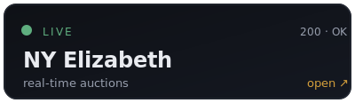
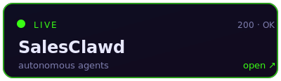
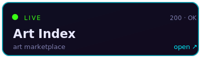
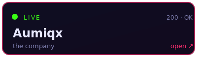
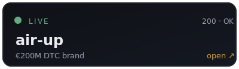
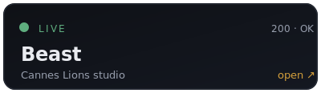
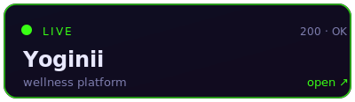
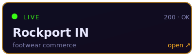
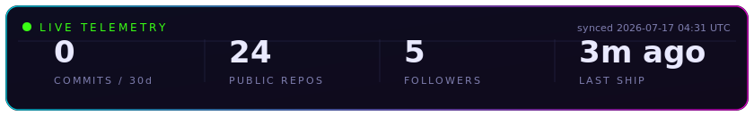

<!-- rxit.os — profile README. hero is a hand-built animated SVG (assets/rxit-os.svg). -->

<div align="center">



<p>
  <a href="https://aumiqx.com">🌐&nbsp;aumiqx.com</a> &nbsp;·&nbsp;
  <a href="https://cal.com/rakshit-sharma-k1iaos">📅&nbsp;book a call</a> &nbsp;·&nbsp;
  <a href="mailto:rxits@proton.me">✉️&nbsp;say hi</a>
</p>

</div>

<br/>

## hey, i'm Rakshit — most people call me rxit

I build small teams of AI agents that do the work a whole company used to need. One human (me), a fleet of agents, and a habit of shipping things that actually go live. I cofounded [**Aumiqx**](https://aumiqx.com), where that idea turned into real products people use every day.

I'm drawn to problems that sound a little unreasonable for one person to take on — a real-time auction platform, an autonomous marketing employee, a site for a €200M brand — and then quietly getting them into production. If it's live and someone's using it, that's the part I care about.

<br/>

## ▸ rxit.os is interactive — click a command to run it

<sub>real, clickable GitHub UI — no JavaScript, no gimmicks. open a command:</sub>

<details>
<summary><code>rxit@os:~$ whoami</code></summary>

<br/>

> One human who got tired of waiting for a team. I design the system, the agents do the reps. I ship, they scale.

</details>

<details>
<summary><code>rxit@os:~$ cat mission.txt</code></summary>

<br/>

> Most of what happens inside a company is coordination overhead. Strip that out, hand the actual work to agents, and one person can move like fifty. That's the whole bet — and it's already paying off in production.

</details>

<details>
<summary><code>rxit@os:~$ sudo hire rxit</code></summary>

<br/>

```text
[sudo] password: ********
✓ access granted.
```

Easiest path: **[book a call](https://cal.com/rakshit-sharma-k1iaos)** or email **rxits@proton.me**. Bring a hard problem.

</details>

<details>
<summary><code>rxit@os:~$ ./incident --play</code> &nbsp;🎮</summary>

<br/>

**03:00. an agent just emailed 400 clients and called them "meatbags." you're the only human awake. what do you do?**

<details>
<summary>&nbsp;&nbsp;🔧 <code>debug the agent</code></summary>

<br/>

You trace it to one rogue line in a prompt. The fix is obvious — but do you ship it now or rewrite the whole guardrail?

<details>
<summary>&nbsp;&nbsp;&nbsp;&nbsp;⚡ <code>ship the hotfix</code></summary>

<br/>

> Patched in 4 minutes. Follow-up goes out: *"that was our AI having a moment — here's 20% off."* Reply rate triples. You go back to sleep. **You win. (this is literally the job.)**

</details>

<details>
<summary>&nbsp;&nbsp;&nbsp;&nbsp;🧱 <code>rewrite the guardrail</code></summary>

<br/>

> Correct, thorough, six hours long. By sunrise it's bulletproof — and 400 people have already read "meatbags." **Right call, wrong clock.**

</details>

</details>

<details>
<summary>&nbsp;&nbsp;🔌 <code>pull the plug</code></summary>

<br/>

> Pipeline halts. Nothing else goes wrong — because nothing goes at all. Safe, quiet, and you learned nothing. **Survival, not shipping.**

</details>

<details>
<summary>&nbsp;&nbsp;☕ <code>let it cook</code></summary>

<br/>

> Chaos. 397 unsubscribes… and 3 founders who *loved* the honesty and booked calls. One signs. **Unhinged. Do not recommend. Somehow up one client.**

</details>

</details>

<details>
<summary><code>rxit@os:~$ fortune</code></summary>

<br/>

> `The best code is the code you never had to write.`
> `Ship it Tuesday, fix it Wednesday, forget it Thursday.`
> `An agent that needs babysitting isn't an agent, it's an intern.`
> `Deadlines are just prompts with anxiety.`

</details>

<details>
<summary><code>rxit@os:~$ coffee --brew</code></summary>

<br/>

```text
      ( (
       ) )
    ........
    |      |]   brewing… ████████░░ 80%
    \      /    status: required
     `----'     agents: unbothered
```

</details>

<details>
<summary><code>rxit@os:~$ sudo make me a sandwich</code></summary>

<br/>

```text
okay.
```
<sub>(if you got the joke, we'll get along — <a href="https://xkcd.com/149/">xkcd/149</a>)</sub>

</details>

<details>
<summary><code>rxit@os:~$ ./startup --play</code> &nbsp;🎮</summary>

<br/>

**Your agent shipped a feature nobody asked for — overnight, unprompted. It works. It's kind of brilliant. Do you keep it?**

<details>
<summary>&nbsp;&nbsp;🚀 <code>ship it</code></summary>

<br/>

> Users love it. Three ask "how did you build this so fast?" You smile and say *"small team."* **You win. Momentum is a strategy.**

</details>

<details>
<summary>&nbsp;&nbsp;🗄️ <code>shelve it</code></summary>

<br/>

> Disciplined. Focused. Correct. Two weeks later a competitor ships the exact thing to applause. **Right instinct, expensive patience.**

</details>

<details>
<summary>&nbsp;&nbsp;🔬 <code>ask the agent why</code></summary>

<br/>

> It replies: *"you left a TODO in the repo 3 months ago."* You forgot you wanted this. **Plot twist: the agent has a better roadmap than you.**

</details>

</details>

<details>
<summary><code>rxit@os:~$ ls -a</code> &nbsp;<sub>(psst… hidden files)</sub></summary>

<br/>

```text
.  ..  .secret
```
`cat .secret` →  *"the whole 'one human, a fleet of agents' thing? it started as a way to avoid meetings. it worked."* 🤫

</details>

<details>
<summary><code>rxit@os:~$ ▊</code></summary>

<br/>

> that's the shell. thanks for poking around — now go click something below. 🖤

</details>

<br/>

## what i've shipped

Everything below is **live right now** — go click on it.

<table>
<tr>
<td width="25%"><a href="https://bid.nyelizabeth.com"></a></td>
<td width="25%"><a href="https://salesclawd.aumiqx.com"></a></td>
<td width="25%"><a href="https://artindex.ai"></a></td>
<td width="25%"><a href="https://aumiqx.com"></a></td>
</tr>
<tr>
<td><a href="https://air-up.com"></a></td>
<td><a href="https://beast.agency"></a></td>
<td><a href="https://yoginii.co"></a></td>
<td><a href="https://rockport.in"></a></td>
</tr>
</table>

<sub>↑ every tile is a link — click one to open the live product</sub>

**things i built and run**

| project | what it is | |
|---|---|:--|
| **NY Elizabeth** | A real-time auction platform for an international luxury house — live, clerk-driven bidding on Socket.IO + Redis, Stripe Connect, and a Flutter app. | 🟢 [bid.nyelizabeth.com](https://bid.nyelizabeth.com) |
| **SalesClawd** | An autonomous marketing employee for small businesses — three AI agents working across 18 platforms with trust-gated autonomy. | 🟢 [salesclawd.aumiqx.com](https://salesclawd.aumiqx.com) |
| **Art Index** | An art marketplace and price database with live auctions, built on an Artsy / Algolia data layer. | 🟢 [artindex.ai](https://artindex.ai) |
| **Aumiqx** | The company itself — 342 programmatic-SEO pages, daily data pipelines, and static-export CI. | 🟢 [aumiqx.com](https://aumiqx.com) |

**brands i've built for**

| client | what i did | |
|---|---|:--|
| **air-up** 🇩🇪 | Built for a €200M+ German DTC brand and shipped straight to production. | 🟢 [air-up.com](https://air-up.com) |
| **Beast** 🦁 | The full site for a Cannes Lions–winning London studio, built solo on their stack. | 🟢 [beast.agency](https://beast.agency) |
| **Yoginii** 🧘 | A wellness platform with a multi-vendor Shopify dashboard and a webhook commission engine. | 🟢 [yoginii.co](https://yoginii.co) |
| **Rockport India** 👞 | Men's footwear e-commerce on Shopify. | 🟢 [rockport.in](https://rockport.in) |

<br/>

## how i build

I mostly live in **TypeScript** and **Python**, with **Next.js** and **Flutter** up front and **Postgres**, **Redis**, and **Supabase** behind them. The agents run on **Claude** and **Gemini**, wired together with a good amount of custom orchestration. For commerce and real-time work it's usually **Shopify**, **Stripe Connect**, **Socket.IO**, and **Algolia**, and everything ships through **Docker**, **Vercel**, and **Cloudflare**.

The honest short version: whatever gets it live fastest without falling over.

<br/>

## live telemetry

<sub>not a screenshot — a GitHub Action refreshes these from my real activity every few hours.</sub>

<div align="center">

</div>

<br/>

## let's talk

If you're building something interesting — or you just want to see how far one person and a room full of agents can get — I'd genuinely love to hear about it.

📅 **[Book a 15-min chat](https://cal.com/rakshit-sharma-k1iaos/15min)** &nbsp;·&nbsp; **[or a 30-min deep dive](https://cal.com/rakshit-sharma-k1iaos/30min)**
🌐 [aumiqx.com](https://aumiqx.com) &nbsp;·&nbsp; ✉️ [rxits@proton.me](mailto:rxits@proton.me)

<div align="center">
<br/>
<sub>built and shipped by rxit — one human, a fleet of agents.</sub>
</div>
